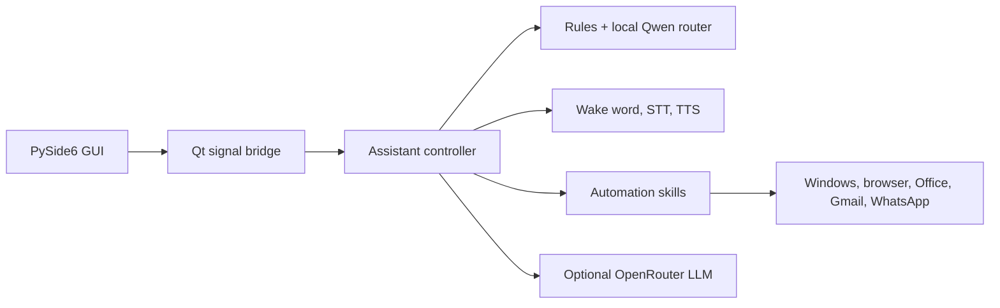

# JARVIS

### Local desktop intelligence for Windows

JARVIS is a cinematic, voice-enabled Windows desktop assistant that combines local speech and intent models with an optional OpenRouter-powered cloud model. It brings voice commands, application control, browser automation, Office workflows, research, email, media, system actions, and an extensible capability registry into one desktop interface.


> [!CAUTION]
> Never commit or share a `.env` file, OpenRouter API key, email app password, private key, browser profile, or other credential. Local secrets, models, databases, logs, caches, and runtime state are excluded by `.gitignore`.

## Features

- “Hey Jarvis” wake phrase, speech recognition, text-to-speech, and barge-in controls
- Fast rule-based command lane plus local Qwen intent routing
- Optional OpenRouter cloud conversation, drafting, research, and summarization
- Cinematic PySide6 dashboard with live subsystem and capability health
- Windows application, window, volume, media, screenshot, and power controls
- Browser, Gmail, WhatsApp, and web research automation
- Word, Excel, and PowerPoint document workflows
- News briefings, persistent memory, file search, and desktop organization
- Text-only, diagnostics, capability self-tests, and model-preload controls
- Modular skill and capability registry for future integrations

## GUI gallery

### Home screen


### Chat and command screen


### Voice screen


### Settings screen


### Capability registry


## GUI technology

The interface is a native Python desktop application built with **PySide6 / Qt 6**. It is not a browser shell: pages, dialogs, buttons, tables, status indicators, system-tray integration, animations, and signal wiring are implemented as Qt widgets.

- `MainWindow` owns the application shell and page navigation.
- `GuiController` and Qt signals keep backend work away from the UI thread.
- Dashboard widgets render assistant, voice, capability, workspace, and system state.
- QSS themes define the cinematic cyan-on-black visual system and reduced-motion mode.
- `SettingsWindow` manages audio, assistant, and system preferences without displaying API keys.
- Static icons and screenshots are stored as repository assets; generated models and builds remain local.

## Requirements

- Windows 11, 64-bit
- Python 3.11 or 3.12
- Microphone and speakers or headphones for voice mode
- Approximately 4 GB free for downloaded models and Chromium
- Internet access for initial downloads and network-backed features
- Optional OpenRouter API key for cloud-backed features
- Optional Microsoft Office, WhatsApp Desktop, and linked service accounts for related skills

## Installation

```powershell
git clone https://github.com/momorzq-oss/JARVIS.git
cd JARVIS
python -m venv .venv
.\.venv\Scripts\Activate.ps1
python -m pip install --upgrade pip
pip install torch==2.4.1 --index-url https://download.pytorch.org/whl/cpu
pip install -r requirements.txt
python -m playwright install chromium
```

If PowerShell blocks activation, run `Set-ExecutionPolicy -Scope Process Bypass` in that terminal and activate the environment again.

### Local configuration

Create a local `.env` file in the project root and add only the values you need:

```dotenv
OPENROUTER_API_KEY=your_key_here
OPENROUTER_MODEL=openai/gpt-oss-safeguard-20b
```

SMTP/IMAP fallback may additionally use `EMAIL_ADDRESS` and `EMAIL_APP_PASSWORD`. Keep all real values local. JARVIS can run without OpenRouter, but cloud-backed features will be unavailable.

## How to run the interface locally

Start the GUI with model preloading disabled for the fastest interface-development loop:

```powershell
python desktop_main.py --skip-model-preload
```

Start the complete GUI, including background model preloading:

```powershell
python desktop_main.py
```

On this Windows installation, double-click **`Launch JARVIS.vbs`** for the
normal desktop launch. It starts the same GUI through a hidden console host,
so a blank `py.exe` terminal cannot cover the JARVIS window.

Useful development commands:

```powershell
python desktop_main.py --debug --skip-model-preload
python main.py --text-only
python -m pytest
```

Build the Windows executable with `.\build_exe.bat`. Build output is generated locally and must not be committed.

## Architecture



The fast lane handles deterministic commands immediately. The local router selects more complex capabilities, while the cloud model is reserved for language-heavy work such as conversation, drafting, research, and summaries.

## Project structure

```text
JARVIS/
├── brain/                    Local and cloud model routing and prompts
├── core/                     Controller, planner, registry, and automation core
├── data/                     Runtime state; generated contents are ignored
├── gui/
│   ├── themes/               Cinematic and reduced-motion QSS themes
│   ├── widgets/              AI core, HUD, metrics, and dashboard components
│   ├── capabilities_page.py  Capability registry and health view
│   ├── dashboard_page.py     Main home, chat, voice, task, and metric panels
│   ├── main_window.py        Window shell, page navigation, and signal wiring
│   ├── secondary_pages.py    Tasks, memory, research, automation, logs, settings
│   ├── settings_window.py    Audio, assistant, and system settings dialog
│   ├── styles.py             Theme loading and fallback styling
│   ├── tray.py               Windows system-tray integration
│   └── workers.py            GUI-safe controller and background work bridge
├── screenshots/              Public GUI screenshots used by this README
├── skills/                   Browser, Office, media, research, and system skills
├── tests/                    Unit, integration, routing, voice, and GUI tests
├── voice/                    Capture, wake word, recognition, and synthesis
├── desktop_main.py           Desktop GUI entry point
├── main.py                   Voice and text assistant entry point
├── icon_preview.png          Interface icon preview
├── jarvis.ico                Windows application icon
└── requirements.txt          Pinned Python dependencies
```

All source pages, widgets, icons, themes, and styles required to rebuild the interface are included. Python caches, virtual environments, downloaded models, browser profiles, executable builds, and release folders are intentionally excluded.

## Current roadmap

- Improve noisy-room wake-word and barge-in accuracy
- Make browser, Gmail, and WhatsApp selectors resilient to UI changes
- Add guided first-run setup and dependency diagnostics
- Improve responsive layouts for laptops and smaller displays
- Expand intent coverage and multilingual command support
- Increase GUI, accessibility, safety, and hardware compatibility tests
- Document and stabilize the third-party skill interface
- Add clearer offline, degraded, and missing-dependency states

## Known issues

- **Blank screen:** slow imports, a missing PySide6 installation, or a damaged QSS/resource path may leave the window empty or prevent it from appearing.
- **Startup:** first launch can be slow while models and browser components download; optional backend imports may delay readiness.
- **Voice:** missing `sounddevice`, unavailable microphones, device permissions, speaker echo, or model download failures can leave voice disconnected.
- **Settings:** audio device enumeration can fail when optional audio packages or drivers are missing; model paths from packaged builds may need correction in development mode.
- **Navigation:** the wide dashboard is optimized for desktop displays; controls can be clipped on small screens or high display scaling.
- Gmail and WhatsApp automation may break when their interfaces change.
- The small local router can misclassify uncommon wording.
- Capabilities remain degraded when optional applications, credentials, models, or permissions are unavailable.

## Help Wanted

Contributors can make an immediate impact on these specific GUI problems:

- Add a startup error screen that reports missing GUI packages and resource paths instead of showing a blank window.
- Make dashboard columns, bottom navigation, tables, and settings dialogs responsive below 1180×700 and at 125–200% scaling.
- Add clear microphone permission, missing-device, and missing-`sounddevice` recovery actions to the voice panel.
- Validate and normalize Piper/model paths when switching between source and packaged builds.
- Preserve the selected navigation page and scroll position across refreshes.
- Add loading, empty, degraded, and failure states to every secondary page.
- Improve keyboard navigation, focus indicators, screen-reader labels, contrast, and reduced-motion behavior.
- Add screenshot-based visual regression tests for dashboard, capability, settings, and voice states.
- Separate chat history from command telemetry and improve long-message rendering.
- Add automated tests for tray restore, settings persistence, navigation, and clean shutdown.

## Contributing

Issues, focused fixes, tests, and feature proposals are welcome.

1. Open an issue for substantial changes so the approach can be discussed.
2. Fork the repository and create a focused branch from `main`.
3. Keep changes small and add or update relevant tests.
4. Run `python -m pytest` and document any checks that cannot run locally.
5. Audit changes for secrets, personal data, logs, databases, generated files, and downloaded models.
6. Submit a pull request describing the problem, solution, testing, and user impact.

Do not put real credentials or private information in commits, issues, screenshots, fixtures, or pull requests.

## Creator

**Mohammed Ali Abdulla Mohammed Al Marzooqi**

Mohammed Ali Abdulla Mohammed Al Marzooqi is an Emirati technology enthusiast, AI developer, and lifelong learner. His work focuses on building practical AI assistants, desktop automation, voice interfaces, and educational technology. He enjoys exploring new approaches to artificial intelligence and creating open source projects that others improve and build upon.

- Website: [kimibrain.com](https://kimibrain.com)
- TikTok: [@burabeeh](https://www.tiktok.com/@burabeeh)
- GitHub: [momorzq-oss](https://github.com/momorzq-oss)

## License

This project is licensed under the MIT License. See the LICENSE file for details.
